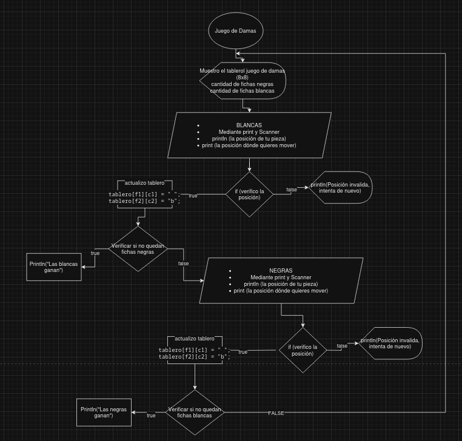

# Examen 1ª Evaluación

---

Día 13 de Diciembre del 2024.

Inicio 8:30hs

Final 10:10hs

Puntuado sobre 100 (para la nota final se divide por 10)

Es el 20% de la nota final del curso

Clona este repositorio (https://github.com/damiancastelao/ex1ev) en github para la respuesta del examen, que tiene que ser un Readme.

Toma las desiciones que veas oportunas y justificalas en el Readme

Apartados:

1. Realiza el diagrama de flujo para recorrer un tablero (8x8) de "Damas", sacando por pantalla si la casilla está ocupada (mostrando la coordenada) y que tipo de ficha es. Además cuenta las fichas de cada jugador sacando por pantalla quien va ganando. **No hace falta usar funciones**. Adjunta imagen y que se vea en el Readme.
   
   
   
2. Como es el tablero? Pon un ejemplo.
   + Muestro el tablero por pantalla del juego de damas y la cantidad de piezas de cada jugador.
   + Solicitar al usuario de blancas las coordenadas de la ficha que quiere mover.
   + Solicitar las coordenadas a dónde quiere mover la ficha.
   + Reviso si el movimiento es válido mediante un if else, si es verdadero, actualiza las posiciones y si es falso tienes que intentar de nuevo.
   + Verifico mediante un if else la si la cantidad de piezas de negras es 0, si es true "Las blancas ganan" y si es false continua.
   + Solicitar al usuario de negras las coordenadas de la ficha que quiere mover.
   + Solicitar al usuario de blancas las coordenadas de la ficha que quiere mover.
   + Solicitar las coordenadas a dónde quiere mover la ficha.
   + Reviso si el movimiento es válido mediante un if else, si es verdadero, actualiza las posiciones y si es falso tienes que intentar de nuevo.
   + Verifico mediante un if else la si la cantidad de piezas de blancas es 0, si es true "Las negras ganan" y si es false continua al inicio.
   + vuelvo a imprimir en pantalla el tablero, la cantidad de piezas repito el bucle.

3. Enumera funciones (mínimo tres) que se podrían utilizar para que el código quede más claro y sea más fácil de mantener.
   + 
   + 
   + 
4. Realiza el javadoc de estas funciones